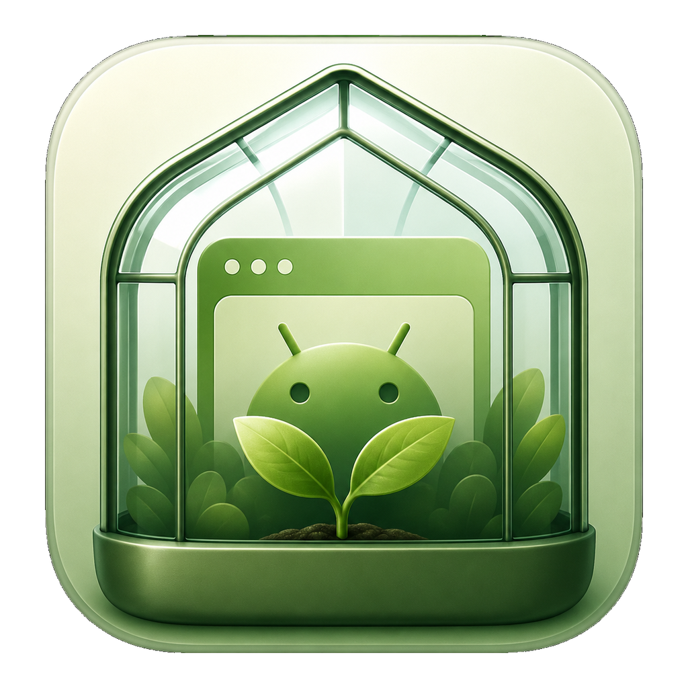
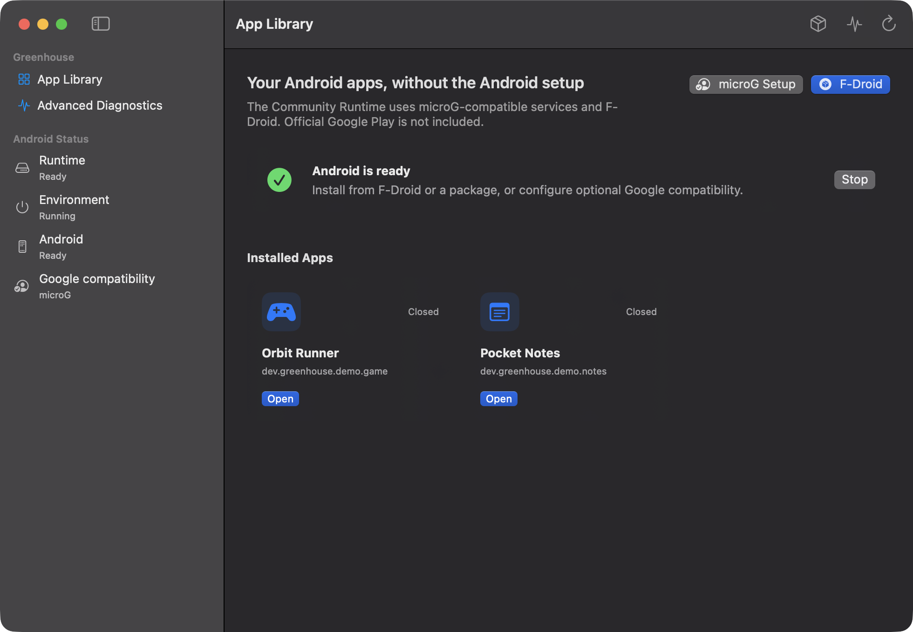
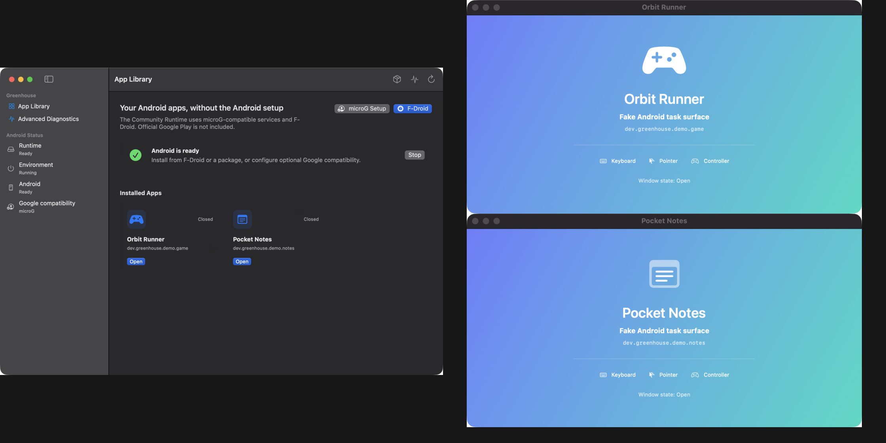

# Project Greenhouse

<p align="center">
  
</p>

<p align="center">
  <strong>Android apps on your Mac, without living inside an emulator.</strong>
</p>

Greenhouse is an open-source macOS app for running compatible Android apps and
games on Apple Silicon. It manages one Android system in the background, then
presents each Android app in its own Mac window.

The experience Greenhouse is working toward is deliberately simple:

```text
Open Greenhouse → Install an app → Open it in its own Mac window
```

No virtual-machine dashboard. No device profiles. No ADB setup. No asking
people to choose an Android image, ABI, CPU count, or graphics backend.



## Android apps should feel like Mac apps

Greenhouse is not trying to put a prettier frame around a phone emulator. The
shared Android system is infrastructure; apps are the product.

Each launched app gets an independent native window with its own lifecycle,
size, focus, input, audio, and display identity. Closing one app should not
stop Android or disturb another app. The environment and installed app data
persist quietly between launches.



<sub>The screenshots show the current native Mac prototype and its deterministic
demo task surfaces. The real Android streaming path is implemented and is
under Community Runtime acceptance testing.</sub>

## Open by design

Greenhouse is being built in public because the runtime should be inspectable,
reproducible, and useful without a proprietary emulator stack.

- The macOS host application is open source under Apache 2.0.
- The Community Runtime is based on Android and LineageOS.
- F-Droid and local APK installation are first-class distribution paths.
- Optional Google API compatibility is provided through microG-compatible
  services.
- Runtime packages and source revisions are pinned and verified.
- Android images, downloaded APKs, signing keys, and user data are never
  committed to this repository.

The Community Runtime does **not** bundle official Google Play or proprietary
Google Mobile Services. A Google Play edition would require a legitimate
licensing and certification agreement; Greenhouse will not disguise
unlicensed Google software as an open-source feature.

See [Community Runtime](docs/community-runtime.md),
[runtime licensing](docs/runtime-licensing.md), and
[third-party notices](THIRD_PARTY_NOTICES.md).

## How it works

```text
Native Greenhouse Mac app
        │
        ├── app library, installation, windows, input, audio
        │
        ▼
Open-source Android Emulator engine
        │
        ├── HVF acceleration on Apple Silicon
        ├── ARM64 Goldfish/Ranchu virtual hardware
        └── gfxstream and MoltenVK graphics path
        │
        ▼
One persistent Community Runtime
        │
        └── one trusted Android virtual display per app
                │
                ├── MediaCodec video and app-scoped audio
                ├── display-targeted keyboard, pointer, IME, and controller input
                └── VideoToolbox decode into a Metal-backed Mac window
```

Greenhouse does not depend on Virtualization.framework scanouts. Android apps
render into independent virtual displays, which are encoded in the guest and
presented by native macOS windows.

Read the [architecture](docs/architecture.md),
[graphics design](docs/graphics-architecture.md), and
[window integration design](docs/window-integration.md) for details.

## Project status

Greenhouse is an active development project, not yet an end-user release.

The native Mac application, Ranchu runtime controller, private ADB transport,
guest app-window agent, MediaCodec protocol, VideoToolbox/Metal presentation,
and display-scoped input/audio plumbing are implemented. Two simultaneous
accelerated virtual-display apps and persistent runtime lifecycle have been
proven with a stock ARM64 AVD.

The main remaining release work is building and validating the complete
LineageOS Community Runtime, exercising real apps and games through the native
window path, and completing signing, notarization, updates, compatibility
testing, and distribution.

Compatibility is intentionally honest:

- Apple Silicon and macOS 15 or later.
- ARM64, universal, or pure Java/Kotlin Android apps.
- No Intel Mac or x86 Android app support.
- No promise that DRM, anti-cheat, Play Integrity, or every phone hardware API
  will work.
- Official Google Play is not included in the Community Runtime.

See the [product contract](docs/product-contract.md),
[compatibility policy](docs/compatibility.md), and [roadmap](docs/roadmap.md).

## Building Greenhouse

Requirements:

- Apple Silicon Mac
- macOS 15 or later
- A current full Xcode installation

Build and launch the native prototype:

```bash
./script/build_and_run.sh
```

Run the complete local verification suite:

```bash
./script/test.sh
```

The normal development app uses a deterministic fake backend so the complete
Mac experience and failure states can be exercised without downloading an
Android image. Runtime acceptance tools and Community Runtime build
instructions live in [Development](docs/development.md).

## Contributing

Contributions are welcome across Swift, Android platform code, graphics,
streaming, input, accessibility, compatibility testing, documentation,
packaging, and design.

Start with [AGENTS.md](AGENTS.md) for the project’s working principles and
[CONTRIBUTING.md](CONTRIBUTING.md) for the development workflow. Security
issues should follow [SECURITY.md](SECURITY.md).

Greenhouse host code is licensed under the
[Apache License 2.0](LICENSE-APACHE). Runtime components retain their own
upstream licenses and redistribution obligations.
